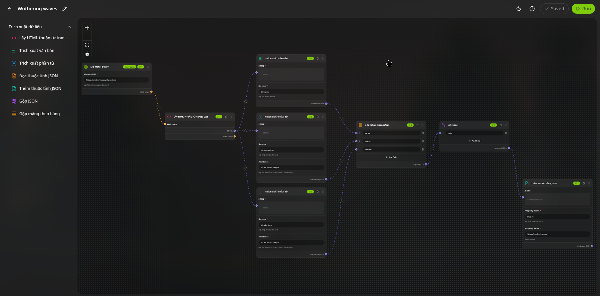
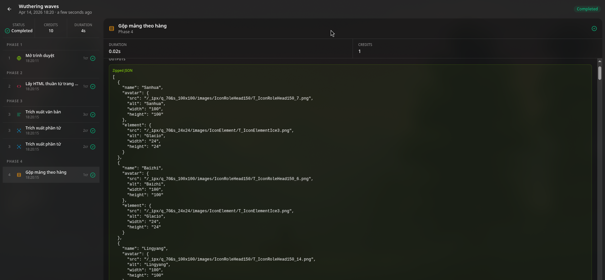

# Rakesite

A visual web scraping automation platform. Build workflows by connecting nodes, extract structured data from any website, and schedule runs — all without writing code.



## What it does

Rakesite lets you build data extraction pipelines visually. Each workflow is a graph of tasks connected by typed edges. You define what to scrape, how to transform it, and when to run it.



## Core features

**Visual workflow editor**

- Drag-and-drop canvas powered by React Flow
- Connect tasks with typed handles — each data type has its own color
- Undo/redo, copy/paste, keyboard shortcuts

**Built-in task library**

- `Launch Browser` — open a URL with Puppeteer
- `Page to HTML` — capture full page HTML
- `Extract Text` — pull text using CSS selectors, supports `selector@attribute` syntax for `src`, `href`, etc.
- `Extract Element` — extract element attributes as JSON
- `Read JSON Property` — read a nested value from JSON using dot notation
- `Add JSON Property` — add or overwrite a field in a JSON object
- `Merge JSON` — combine multiple values into a single JSON object with custom keys
- `Zip Arrays` — zip multiple arrays into an array of objects row by row

**Execution engine**

- Topological execution order based on node dependencies
- Per-phase logs with timestamps and log levels
- Real-time execution viewer with polling
- Credits consumed per task, deducted from user balance

**Scheduling**

- Set cron expressions per workflow
- API endpoint `/api/workflows/cron` for external cron triggers (Vercel Cron, cron-job.org, etc.)

**Execution history**

- Full history per workflow with status, duration, credits
- Drill into each phase to see inputs, outputs, and logs
CRON_SECRET=
```

`CRON_SECRET` is used to authenticate requests to `/api/workflows/cron`. Set the same value in your cron service as a Bearer token.
